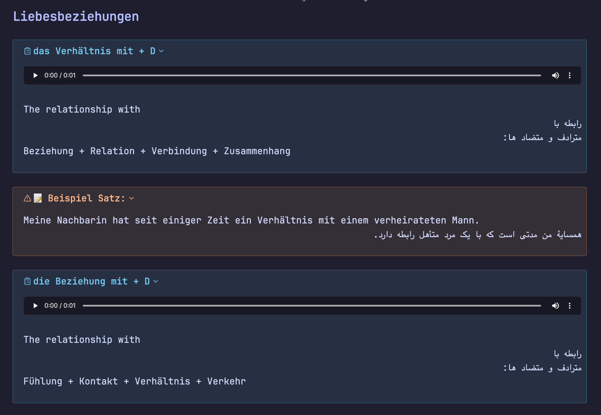

# Learning German Tools (from English and Farsi)

<div align="center">


</div>

__🌟 Hey there! Welcome to my language learning helper project! 🌟__

This whole thing started because I wanted a better way to learn German (my current language adventure!). Since I use Obsidian for all my notes and Anki for flashcards, I began crafting these little scripts to bridge the gap.

Over time, they grew and evolved a lot – tweaking, fixing, and improving until they became the handy tools you see today. I realized others might find them useful too, especially fellow Persian speakers diving into German. So, why keep them to myself? Sharing is caring! 😊

**Looking ahead**: Once I hit my own German goals, I’d love to expand this into a multilingual helper, supporting way more languages than just Persian and German. The dream is big!

**For now though?** Below is the project exactly as it is – my little labor of love, ready for you to explore, use, and maybe even improve. Hope it helps you like it helped me!

---
A comprehensive toolkit for learning German that combines automated translation, audio pronunciation, and flashcard generation. This project streamlines the process of creating study materials by extracting definitions, examples, and audio from online sources and formatting them into structured markdown notes and Anki flashcards.

## ✨ Features

- 🔤 Automated translation of German words to English and Persian
- 🔊 Audio pronunciation downloads from online dictionaries
- 📚 Extraction of detailed definitions, synonyms, antonyms, and example sentences
- 📝 Markdown-formatted study notes with proper German capitalization
- 🎴 Conversion of notes to Anki flashcards with beautiful formatting
- 📋 Support for example sentences and contextual usage
- 🌙 Dark mode support for Anki cards
- 📤 Extract examples from Obsidian notes for focused study

## 🛠️ Components

The project is organized as a Python package with the following structure:

```
learning_german/
├── config/           # Configuration settings
├── gui/              # GUI application (placeholder for future implementation)
├── templates/        # Anki card templates and styles
├── utils/            # Utility functions
│   ├── de_pronunciation_retriever.py  # Audio download functionality
│   ├── fa_definition_retriever.py     # Persian definitions retrieval
│   └── text_processing.py             # Text processing utilities
├── anki_deck_generator.py             # Convert markdown to Anki cards
├── markdown_note_generator.py         # Generate markdown from German words
└── obsidian_oords_and_examples_extractor.py  # Extract examples from Obsidian notes
```

## 📋 Requirements

- Python 3.6+
- Required Python packages:
  - genanki: For creating Anki decks
  - deep-translator: For translating German words
  - requests: For making HTTP requests
  - beautifulsoup4: For parsing HTML content
  - aiohttp & aiofiles: For asynchronous operations

## 🚀 Installation

1. Clone this repository:

   ```bash
   git clone https://github.com/a-endari/Learning_German.git
   cd Learning_German
   ```

2. Install the package and its dependencies:

   ```bash
   pip install -e .
   ```

   Or using pipenv:

   ```bash
   pipenv install
   ```

## 📖 Usage

### Step 1: Create Your Input File

Create a file named `input.md` in the `data_files/input/` directory with your German vocabulary:

```
# Animals
der Hund
die Katze
das Pferd
> Der Hund spielt mit der Katze.
```

#### Input File Format Guidelines

1. **Headers**: Lines starting with `#` are treated as section headers:

   ```
   # Animals
   ```

2. **Words with Articles**: Include the article for nouns (der, die, das):

   ```
   der Tisch
   die Katze
   das Haus
   ```

3. **Example Sentences**: Lines starting with `>` are treated as example sentences:

   ```
   > Ich habe einen Hund.
   ```

4. **Words with Additional Information**: You can include additional information after commas or hyphens:

   ```
   der Tisch, table
   die Katze - cat
   ```

   The script will only process the part before the comma/hyphen.

5. **Words with Asterisks**: Asterisks at the end of words are automatically removed:

   ```
   der Tisch*
   ```

### Step 2: Generate Markdown Notes

Run the markdown note generator using the installed command-line tool:

```bash
german-translate
```

Or run the module directly:

```bash
python -m learning_german.markdown_note_generator
```

This will:

- Process each word in your input file
- Translate words to English and Persian
- Download audio pronunciations
- Extract detailed Persian definitions and synonyms
- Generate a formatted markdown file in `data_files/output/output.md`

#### Output Format

The generated `output.md` file will contain:

1. **Word entries** formatted as collapsible callouts with translations:

   ```
   > [!tldr]- der Tisch
   > ![[Tisch.wav]]
   > table
   > میز
   > --- (Persian definition here)
   ```

2. **Example sentences** formatted as warning callouts:

   ```
   > [!warning]- 📝 Beispiel Satz:
   > Das ist ein Tisch.
   > این یک میز است.
   ```

3. **Headers** preserved as is:

   ```
   # Furniture
   ```

### Step 3: Convert to Anki Flashcards

Convert your markdown notes to Anki flashcards using the installed command-line tool:

```bash
german-to-anki data_files/output/output.md --deck-name "German Vocabulary"
```

Or run the module directly:

```bash
python -m learning_german.anki_deck_generator data_files/output/output.md --deck-name "German Vocabulary"
```

Parameters:

- First parameter: Path to the markdown file containing callouts
- `--deck-name` (optional): Name for the Anki deck. If not provided, the filename without extension will be used

This will create an `.apkg` file in the `data_files/output/` directory that you can import directly into Anki.

#### Anki Card Format

The generated Anki cards include:

- **Front**: German word with article
- **Back**:
  - English translation
  - Persian translation
  - Persian definitions and examples
  - Synonyms and antonyms (if available)
  - Example sentences (if provided)

**Reverse Cards**: The system automatically creates reverse cards where:

- **Front**: Persian translation
- **Back**: German word
- Any example sentences are included on both card types


*Example of generated Anki flashcard with translations and example sentences*

### Step 4: Extract Examples from Obsidian Notes (Optional)

If you have Obsidian notes with German vocabulary and examples, you can extract just the examples for focused study:

```bash
python -m learning_german.obsidian_oords_and_examples_extractor path/to/your/obsidian_note.md
```

This will:

- Extract example sentences (lines after "Beispiel" and "satz")
- Extract word entries (lines starting with "> [!tldr]- ")
- Create a text file with the same name as the input file but with a .txt extension in the output directory

## 📱 Using with Obsidian

1. Run the markdown note generator to create `output.md` and audio files in the `Media` folder
2. Copy `output.md` to your Obsidian vault
3. Copy the audio files from the `Media` folder to your Obsidian vault's media folder
4. Open the note in Obsidian to see the formatted dictionary with playable audio


*Example of German vocabulary notes in Obsidian with collapsible sections and audio playback* Theme: catppuccin (Dark Mode)

### Obsidian Integration Benefits

- **Collapsible Callouts**: Words and definitions are organized in collapsible sections
- **Audio Playback**: Click on audio links to hear pronunciations
- **Beautiful Formatting**: Consistent styling makes studying more enjoyable
- **Searchable Content**: Easily find words and examples using Obsidian's search

## 🔧 Customization

### Configuration Settings

You can modify settings in `src/learning_german/config/settings.py`:

- `INPUT_FILE`: Path to your input markdown file
- `OUTPUT_FILE`: Path where the generated markdown will be saved
- `MEDIA_FOLDER`: Folder for storing audio files
- `OUTPUT_DIR`: Directory for Anki deck output
- `MIN_WORD_LENGTH`: Minimum length for words to be processed
- `AUDIO_SEARCH_PATHS`: List of paths to search for existing audio files

### Adding Custom Translations

If you want to add custom translations or definitions:

1. Process your words normally
2. Edit the generated `output.md` file to add or modify translations
3. Convert to Anki cards as usual

### Customizing Anki Card Styles

The project includes comprehensive styling for Anki cards, including dark mode support. You can customize the appearance by modifying the CSS in `src/learning_german/templates/anki_card_styles.py`.

## 🔍 Troubleshooting

### Common Issues

1. **No Audio Found**: Some words may not have audio available. The script will notify you and continue processing.

   Solution: Try alternative spellings or check if the word exists in the online dictionary.

2. **Translation Errors**: Occasionally, translations may be inaccurate.

   Solution: Edit the output markdown file before converting to Anki cards.

3. **File Not Found Errors**: Ensure your input file exists at the specified path.

   Solution: Check the path in `settings.py` and make sure the file exists.

4. **Internet Connection Issues**: The tool requires an internet connection for translations and audio.

   Solution: Verify your internet connection and try again.

## 💡 Tips for Effective Learning

- **Group Related Words**: Use headers to organize words by topic
- **Include Example Sentences**: Add context to help with retention
- **Review Regularly**: Import cards into Anki and review daily
- **Use Audio**: Listen to pronunciations to improve your accent
- **Add Your Own Notes**: Customize cards with personal mnemonics
- **Extract Examples**: Use the example extractor to focus on sentence patterns

## 🧪 Testing

**NOT IMPLIMENTED YET!**

The project includes test files for various components:

- `tests/test_retrievers.py`: Tests for pronunciation and definition retrieval
- `tests/test_markdown_generator.py`: Tests for markdown generation
- `tests/test_anki_generator.py`: Tests for Anki deck generation

Run tests using pytest:

```bash
pytest
```

## 🤝 Contributing

Contributions are welcome! Please feel free to submit a Pull Request.

1. Fork the repository
2. Create your feature branch (`git checkout -b feature/amazing-feature`)
3. Commit your changes (`git commit -m 'Add some amazing feature'`)
4. Push to the branch (`git push origin feature/amazing-feature`)
5. Open a Pull Request

## 📄 License

This project is licensed under the MIT License - see the LICENSE file for details.

## 🙏 Acknowledgments

- [Genanki](https://github.com/kerrickstaley/genanki) for Anki package generation
- [Deep Translator](https://github.com/nidhaloff/deep-translator) for translation capabilities
- [BeautifulSoup](https://www.crummy.com/software/BeautifulSoup/) for web scraping
- [Obsidian](https://obsidian.md/) for markdown note-taking capabilities
- [aiohttp](https://docs.aiohttp.org/) for asynchronous HTTP requests
